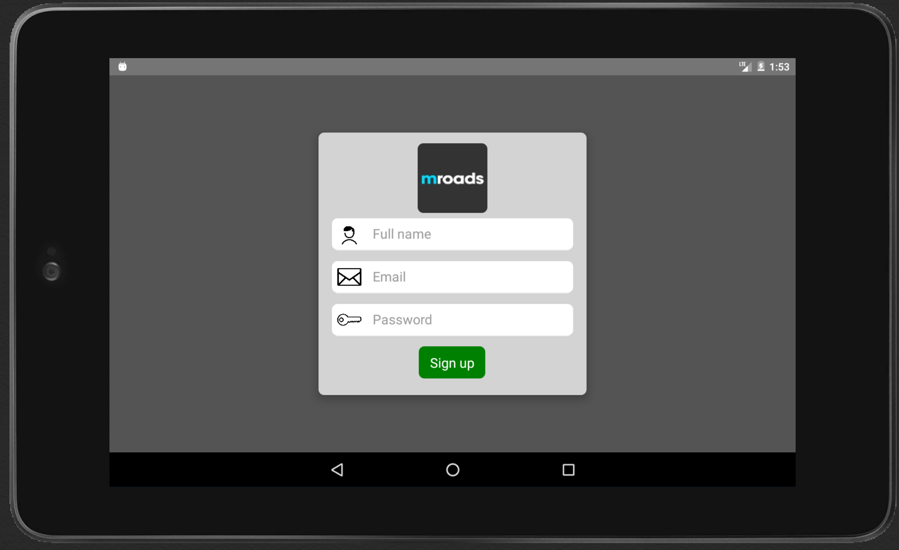
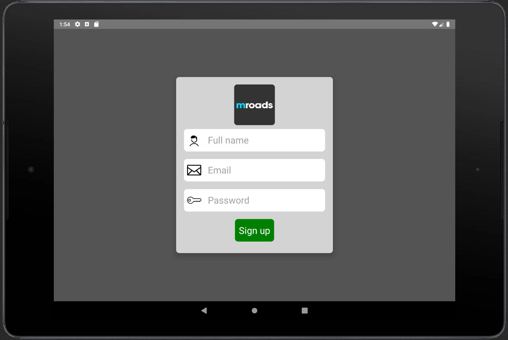
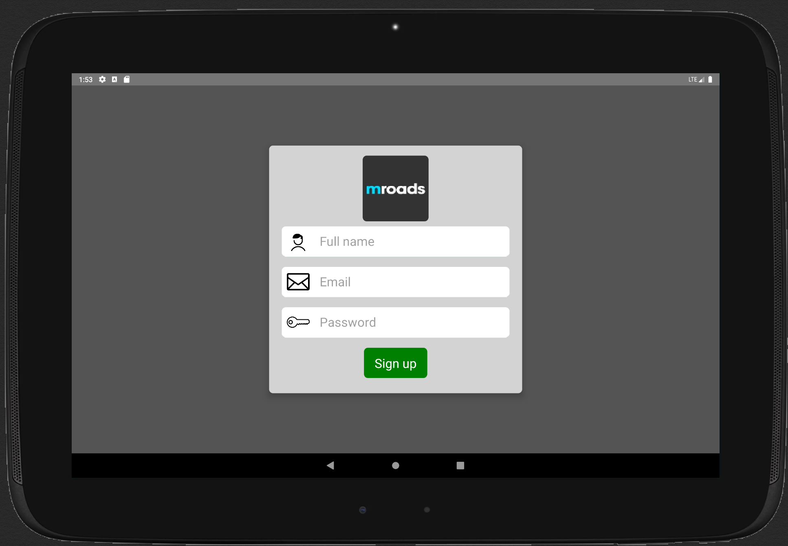
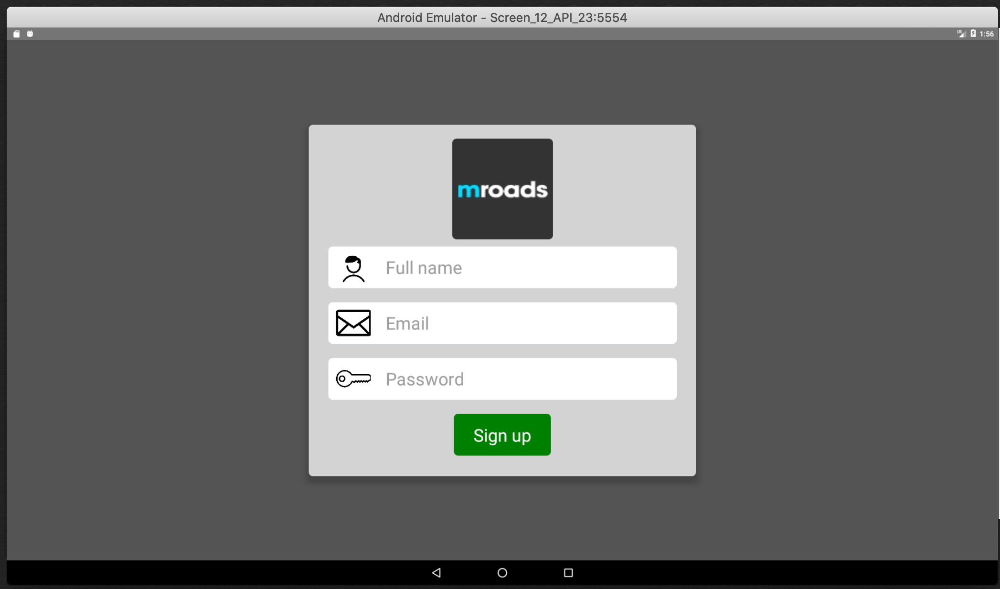

# React Native Responsive View Port

**react-native-view-port** is a light weight library that provides a function to make your React Native UI responsive. This package dosen't use any additional packages or libraries.

It provides a solution to convert your existing React-native project to responsive. It supports for apps that are built only for single orientation.

To save time in making or converting react-native project responsive try this.

| 7-Inch Screen | 9-Inch Screen |
| --- | --- |
|  |  |

| 10-Inch Screen | 12-Inch Screen |
| --- | --- |
|  |  |

# Setup
### Installation

`$ npm install react-native-responsive-view-port --save`

or

`$ yarn add react-native-responsive-view-port`


## Usage

* When importing this package to the component, package gets the device's width and height. If we have a base device in mind that we build the app for we can pass their width and height for the future screens references. If we don't pass these values by default base device config will be *1280X800*. Based on these it calculates the device's view-ports to scale the UI for different devices.

* The package provides a function createViewPortConfig. As mentioned above for this function we can pass width and height of the base device as a *number* value *I.e. createViewPortConfig(1920, 1080)* it returns an *object* with view-port height **vh** and view-port width **vw** for the base device size to current screen's width/height respectivelly. Below given example demonstrates how to use the function and the returned view-port values.

* Main objectives of these package is to make the product responsive and to do it in a easy and effortless way. So the function returns an object with **vh** and **vw** which can be used similar to the view-ports that are used in web development.

* To make your code responsive multiply the **vw** and **vh** values with the style elements.
i.e. width: 200 * vw; height: 150 * vh; fontSize: 25 * vh.

* The suggested approach is to import the package to a common exported component and pass the base device width and height and export the **vh** and **vw** values for **global use** in your project. Try the given example for better understanding.

### Props
```
import {createViewPortConfig} from 'react-native-responsive-view-port';
// If you don't pass base device width and height it calculates view-port for the following
// default values default baseDevice width=1280 and height=800
const { vw, vh } = createViewPortConfig();
```
##### Function you need to call. This function by default returns the viewport values for screen size 1280 X 800.

| Prop           |     Default     |   Type   | Description                                                                                                 |
| :------------- | :-------------: | :------: | :---------------------------------------------------------------------------------------------------------- |
| createViewPortConfig     |  () => {}  |  `function`  | Call to get viewport values.|

### Basic
```javascript

import React, { Component } from 'react';
import {
  StyleSheet,
  Text,
  View,
  TextInput,
  Button,
  TouchableHighlight,
  Image,
  Alert
} from 'react-native';
import {createViewPortConfig} from 'react-native-responsive-view-port';

const { vw, vh } = createViewPortConfig();

const imageUrl = 'https://media.glassdoor.com/sql/958743/mroads-squarelogo-1458830826065.png';
const userImage = 'https://img.icons8.com/pastel-glyph/2x/user-male.png';
const emailImage = 'https://image.flaticon.com/icons/png/512/9/9923.png';
const passwordImage = 'http://icons.iconarchive.com/icons/iconsmind/outline/512/Key-icon.png';

export default class Register extends Component {

  constructor(props) {
    super(props);
    state = {
      fullName: '',
      email   : '',
      password: '',
    }
  }

  render() {
    return (
      <View style={styles.container}>
        <View style={styles.viewCard}>
	<View style={styles.imageContainer} ><Image style={styles.imageStyle} source={{uri: imageUrl }}/></View>
	<View style={styles.inputContainer}>
	  <Image style={styles.inputIcon} source={{uri: userImage }}/>
	  <TextInput style={styles.inputs}
	    placeholder="Full name"
	    keyboardType="email-address"
            underlineColorAndroid='transparent'
	    onChangeText={(fullName) => this.setState({fullName})}
	   />
	</View>
	<View style={styles.inputContainer}>
	  <Image style={styles.inputIcon} source={{uri: emailImage }}/>
	  <TextInput style={styles.inputs}
	    placeholder="Email"
	    keyboardType="email-address"
	    underlineColorAndroid='transparent'
	    onChangeText={(email) => this.setState({email})}
	   />
	</View>
	<View style={styles.inputContainer}>
	  <Image style={styles.inputIcon} source={{uri: passwordImage }}/>
	  <TextInput style={styles.inputs}
	    placeholder="Password"
	    secureTextEntry={true}
	    underlineColorAndroid='transparent'
	    onChangeText={(password) => this.setState({password})}
	  />
	</View>
	<TouchableHighlight style={[styles.buttonContainer, styles.signupButton]}>
	  <Text style={styles.signUpText}>Sign up</Text>
	</TouchableHighlight>
        </View>
      </View>
    );
  }
}

const styles = StyleSheet.create({
  container: {
    flex: 1,
    justifyContent: 'center',
    alignItems: 'center',
    backgroundColor: '#545454',
  },
	viewCard: {
		backgroundColor: '#d3d3d3',
		justifyContent: 'center',
		alignItems: 'center',
		paddingVertical: 10 * vh,
		paddingHorizontal: 15 * vw,
		borderRadius: 8,
		shadowOffset:{  width: 10 * vw,  height: 10 * vw },
		shadowColor: 'black',
		shadowOpacity: 1.0,
		elevation: 10,
		width: 500 * vw,
	},
  inputContainer: {
      borderBottomColor: '#F5FCFF',
      backgroundColor: '#FFFFFF',
      borderBottomWidth: 1,
      width: 450 * vw,
      height: 60 * vh,
      marginBottom: 20 * vh,
      flexDirection: 'row',
      alignItems:'center',
      borderRadius: 8,
  },
  inputs:{
      height: 60 * vh,
      marginLeft: 16 * vw,
      borderBottomColor: '#FFFFFF',
      flex:1,
      justifyContent: 'center',
      fontSize: 25 * vh,
  },
  inputIcon:{
    width: 45 * vw,
    height: 45 * vw,
    marginLeft: 10 * vw,
    justifyContent: 'center',
  },
  imageContainer: {
    justifyContent: 'center',
    alignItems: 'center',
    backgroundColor: '#d3d3d3',
    marginVertical: 10 * vh,
  },
  imageStyle: {
    width: 130 * vw,
    height: 130 * vw,
    justifyContent: 'center',
    borderRadius: 8,
  },
  buttonContainer: {
    height: 60 * vh,
    flexDirection: 'row',
    justifyContent: 'center',
    alignItems: 'center',
    marginBottom: 20 * vh,
    width: 125 * vw,
    borderRadius: 8,
  },
  signupButton: {
    backgroundColor: 'green',
  },
  signUpText: {
    color: 'white',
    fontSize: 25 * vh,
  }
});
```
